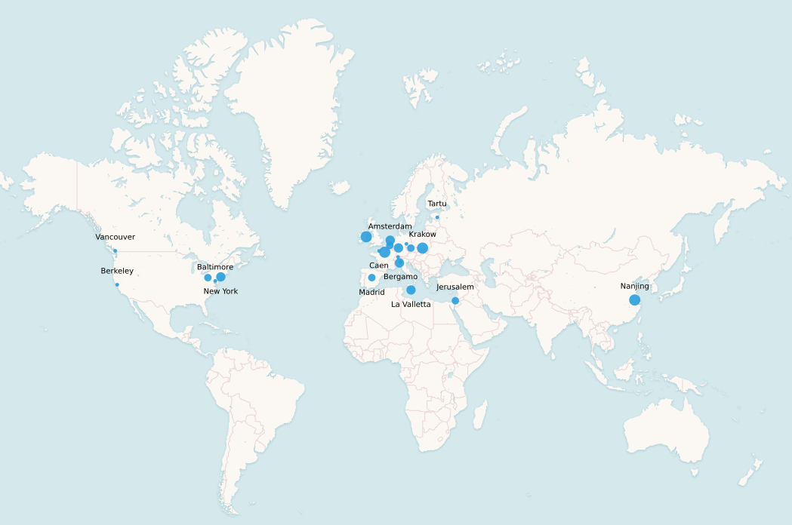

***

--<a href="index">Home</a>--&nbsp;&nbsp;--<a href="CFP">CFP</a>--&nbsp;&nbsp;--<a href="EvaLatin">EvaLatin</a>--&nbsp;&nbsp;--<a href="Keynote">Keynote Speaker</a>--&nbsp;&nbsp;--Program--&nbsp;&nbsp;--<a href="organization">Organization</a>--

***

**Due to the COVID-19 pandemic, the workshop will not take place. However, the [proceedings are published online](https://lrec2020.lrec-conf.org/media/proceedings/Workshops/Books/LT4HALAbook.pdf).**

## Accepted Papers
- "Dating and Stratifying a Historical Corpus with a Bayesian Mixture Model" -*Oliver Hellwig*
- "Automatic Construction of Aramaic-Hebrew Translation Lexicon" -*Chaya Liebeskind and Shmuel Liebeskind*
- "Dating Ancient texts: an Approach for Noisy French Documents" -*Anaëlle Baledent, Nicolas Hiebel and Gaël Lejeune*
- "Lemmatization and POS-tagging process by using joint learning approach. Experimental results on Classical Armenian,Old Georgian, and Syriac" -*Chahan Vidal-Gorène and Bastien Kindt*
- "Computerized Forward Reconstruction for Analysis in Diachronic Phonology, and Latin to French Reflex Prediction" -*Clayton Marr and David R. Mortensen*
- "Using LatInfLexi for an Entropy-Based Assessment of Predictability in Latin Inflection" -*Matteo Pellegrini*
- "A Tool for Facilitating OCR Postediting in Historical Documents" -*Alberto Poncelas, Mohammad Aboomar, Jan Buts, James Hadley and Andy Way*
- "Integration of Automatic Sentence Segmentation and Lexical Analysis of Ancient Chinese based on BiLSTM-CRF Model" -*Ning Cheng, Bin Li, Liming Xiao, Changwei Xu, Sijia Ge, Xingyue Hao and Minxuan Feng*
- "Automatic semantic role labeling in Ancient Greek using distributional semantic modeling" -*Alek Keersmaekers*
- "A Thesaurus for Biblical Hebrew" -*Miriam Azar, Aliza Pahmer and Joshua Waxman*
- "Word Probability Findings in the Voynich Manuscript" -*Colin Layfield, Lonneke van der Plas, Michael Rosner and John Abela*
- "Comparing Statistical and Neural Models for Learning Sound Correspondences" -*Clémentine Fourrier and Benoît Sagot*
- "Distributional Semantics for Neo-Latin" -*Jelke Bloem, Maria Chiara Parisi, Martin Reynaert, Yvette Oortwijn and Arianna Betti*
- "Latin-Spanish Neural Machine Translation: from the Bible to Saint Augustine" -*Eva Martínez Garcia and Álvaro García Tejedor*
- "Detecting Direct Speech in Multilingual Collection of 19th-century Novels" -*Joanna Byszuk, Michał Woźniak, Mike Kestemont, Albert Leśniak, Wojciech Łukasik, Artjoms Šeļa and Maciej Eder*

## EvaLatin reports
- "Overview of the EvaLatin 2020 Evaluation Campaign" - *Rachele Sprugnoli, Marco Passarotti, Flavio Massimiliano Cecchini and Matteo Pellegrini*
- "Data-driven Choices in Neural Part-of-Speech Tagging for Latin" - *Geoff Bacon*
- "JHUBC’s Submission to LT4HALA EvaLatin 2020" - *Winston Wu and Garrett Nicolai*
- "A Gradient Boosting-Seq2Seq System for Latin POS Tagging and Lemmatization" - *Celano Giuseppe*
- "UDPipe at EvaLatin 2020: Contextualized Embeddings and Treebank Embeddings" - *Milan Straka and Jana Straková*
- "Voting for POS tagging of Latin texts: Using the flair of FLAIR to better Ensemble Classifiers by Example of Latin" - *Manuel Stoeckel, Alexander Henlein, Wahed Hemati and Alexander Mehler*

Cities of affiliation of the authors.

