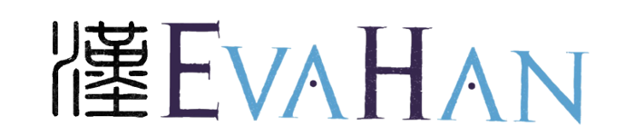

***

<b>LT4HALA 2022</b>

--<a href="index">Home</a>--&nbsp;&nbsp;--<a href="CFP">CFP</a>--&nbsp;&nbsp;--<a href="EvaLatin">EvaLatin</a>--&nbsp;&nbsp;--EvaHan--&nbsp;&nbsp;--<a href="Program">Program</a>--&nbsp;&nbsp;--<a href="organization">Organization</a>--

***

## EvaHan

- [Introduction](#introduction)
- [Important Dates](#important-dates)
- [Data](#data)
  * [Training Data](#training-data)
  * [Test Data](#test-data)
- [Scorer](#scorer)
- [How to participate](#how-to-participate)

___

### INTRODUCTION

EvaHan 2022 is the first campaign totally devoted to the evaluation of Natural Language Processing (NLP) tools for the Ancient Chinese language. The Ancient Chinese language is dated back around 1000BC-221BC. 

EvaHan first edition has one task (i.e. a joint task of Word Segmentation and POS Tagging).

EvaHan 2022 is organized by Bin Li, Yiguo Yuan, Minxuan Feng, Chao Xu, Dongbo Wang.

### IMPORTANT DATES
- 20 December 2021: training data available
- Evaluation Window
  - 10 March 2022: test data available
  - 16 March 2022: system results due to organizers
- 30 March 2022: reports due to organizers
- 06 April 2022: short report review deadline
- 20 April 2022: camera ready version of reports due to organizers

### DATA

| Data Sets | Data name | Sources | Word Tokens| Char Tokens|
|-----------| ----------|---------|---  -------|-----------------|
| Train | Zuozhuan_Train| Zuozhuan| 166,142| 194,995|
| Test A| Zuozhuan_Test | Zuozhuan| 28,131 | 33,298 |
| Test B| Blind_Test| Other similar ancient ChineseBook| Around 40,000| Around 50,000|

#### Training Data

Download training data: [zuozhuan_train_utf8.zip](https://github.com/CIRCSE/LT4HALA/blob/master/2022/data_and_doc/zuozhuan_train_utf8.zip)

#### Test Data

Test data will be provided in raw format, only Chinese characters and punctuation. The gold standard test data, that is the annotation used for the evaluation, will be provided to the participants after the evaluation. 
There are two test data sets. Test A is designed to see how a system perform on the data from the same book. Zuozhuan_Test is extracted from Zuozhuan, not overlapping with Zuozhuan_Train.
Test B is designed to see how a system performs on similar data (texts of similar content but from a different book). Blind_Test has not been released publicly. The size of it is similar to Zuozhuan_Test.
The details of the test data will be provided to the participants after the evaluation.

### SCORER
Download the scorer: [EvaHan_scorer](https://github.com/CIRCSE/LT4HALA/blob/master/2022/data_and_doc/EvaHan_scorer.zip)

### HOW TO PARTICIPATE

Each participant can submit runs following two modalities. In the closed modality, the resources each team could use are limited. Each team only use the Training data Zuozhuan_Train, and the pretrained model SIKU-Roberta. It is word embeddings pretrained on a very large corpus of traditional Chinese collection, Siku Quanshu(四库全书). Other resources are not allowed in the closed modality.
In the open modality, there is no limit on the resources, data and models. Annotated external data, such as the components or Pinyin of the Chinese characters, word embeddings can be employed. But each team has to state all the resources, data and models they use in each system in the final report.

For detailed information, please read the [guidelines](https://github.com/CIRCSE/LT4HALA/blob/master/2022/data_and_doc/EvaHan_guidelines_v1_training.pdf).

***

Back to the <a href="https://circse.github.io/LT4HALA/"><b>Main Page</b></a>

***

