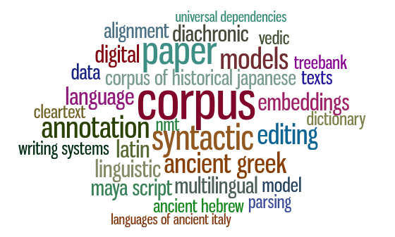

***

<b>LT4HALA 2022</b>

--Home--&nbsp;&nbsp;--<a href="CFP">CFP</a>--&nbsp;&nbsp;--<a href="EvaLatin">EvaLatin</a>--&nbsp;&nbsp;--<a href="EvaHan">EvaHan</a>--&nbsp;&nbsp;--<a href="Program">Program</a>--&nbsp;&nbsp;--<a href="organization">Organization</a>--

***

# Second Workshop on Language Technologies for Historical and Ancient Languages (#LT4HALA2022)
## Co-located with [LREC 2022](https://lrec2022.lrec-conf.org/)
## Location: Marseille, France
## Date: June 25 2022 (post-conference workshop)
## Submission page: [https://www.softconf.com/lrec2022/LT4HALA/](https://www.softconf.com/lrec2022/LT4HALA/)

**[Proceedings](http://www.lrec-conf.org/proceedings/lrec2022/workshops/LT4HALA/2022.lt4hala2022-1.0.pdf) are online.**
Word-cloud of keywords extracted from the abstracts with [KD-Keyphrase digger](http://dhlab.fbk.eu:8080/KD_KeyDigger/).

**NEW SUBMISSION DEADLINE: 15 APRIL 2022**

This **one-day workshop** seeks to bring together scholars, who are developing and/or are using Language Technologies (LTs) for historically attested languages, so to foster cross-fertilization between the Computational Linguistics community and the areas in the Humanities dealing with historical linguistic data, e.g. historians, philologists, linguists, archaeologists and literary scholars. Despite the current availability of large collections of digitized texts written in historical languages, such interdisciplinary collaboration is still hampered by the limited availability of annotated linguistic resources for most of the historical languages. Creating such resources is a challenge and an obligation for LTs, both to support historical linguistic research with the most updated technologies and to preserve those precious linguistic data that survived from past times.

The workshop will also be the venue of the:
- second edition of [EvaLatin](EvaLatin), the evaluation campaign totally devoted to the evaluation of NLP tools for Latin;
- first edition of [EvaHan](EvaHan), the first evaluation campaign totally devoted to the evaluation of NLP tools for Ancient Chinese.

***

Back to the <a href="https://circse.github.io/LT4HALA/"><b>Main Page</b></a>

***
