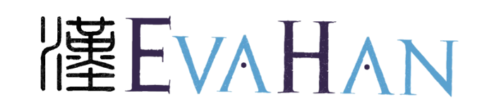

<b>LT4HALA 2026</b>

--<a href="index">Home</a>--&nbsp;&nbsp;--<a href="CFP">CFP</a>--&nbsp;&nbsp;--<a href="EvaLatin">EvaLatin</a>--&nbsp;&nbsp;--EvaHan--&nbsp;&nbsp;--<a href="EvaCun">EvaCun</a>--&nbsp;&nbsp;--<a href="Program">Program</a>--&nbsp;&nbsp;--<a href="organization">Organization</a>--

## EvaHan 2026

-   <a href="https://github.com/GoThereGit/EvaHan"><b>EvaHan 2026</b></a> is the Fifth International Evaluation of Ancient Chinese
    Information Processing, focusing on OCR tasks for multimodal large
    language models in ancient Chinese.

-   Co-organized with LREC 2026, which will be held from May 11 to 16,
    2026, in Mallorca, Spain.

-   EvaHan 2026 is organized by Dongbo Wang, Bin Li, Minuxan Feng, Chao
    Xu, Weiguang Qu, Liu Liu, Si Shen.

## Previous Tasks

-   EvaHan 2022

The First Bake-off of ancient Chinese automatic processing was
successfully held in Marseille, France, in 2022, with a focus
on automatic word segmentation and part-of-speech tagging of ancient
Chinese.

-   EvaHan 2023

The Second Bake-off of ancient Chinese automatic processing was
successfully held in Macau, China, in 2023, with a focus on machine
translation of ancient Chinese.

-   EvaHan 2024

The Third Bake-off of ancient Chinese automatic processing was held in
Turin, Italy, in 2024, with a focus on automatic sentence segmentation
and punctuation of ancient Chinese.

-   EvaHan 2025

The Fourth Bake-off of ancient Chinese automatic processing was held in
New Mexico, USA, in 2025, with a focus on named entity recognition in
ancient Chinese.

## Important Dates for EvaHan 2026

-   [Registration](https://jsj.top/f/nWLK2R) deadline: January 30, 2026

-   Training data release: January 1, 2026

-   Test data release:  **February 3, 2026, 23:50**     ~~**February 1, 2026**~~

-   Running results submission: **February 9, 2026, 23:50**      ~~**February 6, 2026**~~~~

-   Technical report submission deadline: February 28, 2026

-   Notification of acceptance: March 1, 2026

-   Camera-ready papers due: March 10, 2026

## Participation

To participate in EvaHan 2026, you must complete the following steps:

1. **Registration:**\
Fill in the [registration form](https://jsj.top/f/nWLK2R) to officially register your team for the
task. Registration is open from December 1, 2025, to January 30, 2026.
Only registered participants will gain access to the training dataset.

2. **Accessing the Training Data:**\
After completing the registration process, participants will receive
instructions for downloading the training dataset, which includes
image--text pairs from ancient Chinese texts for OCR.

3. **Submitting Results and Reports:**\
Participants must use the provided test data to generate results and
submit their system outputs and a technical report as per the shared
task schedule.

For inquiries or to request the registration form, please contact us
at [evahan2026@gmail.com](mailto:evahan2025@gmail.com).

**Data**

The Evahan 2026 dataset comprises three datasets, covering image-text
pairs: plain text images, mixed image-text images, and handwritten
images-text. The data underwent initial automatic annotation, followed
by meticulous correction and refinement by experts in classical Chinese
language and history to ensure the highest quality of the training
materials and gold-standard texts.

● Dataset A (Printed Texts) consists of data selected from the *Siku Quanshu* (Complete
Library of the Four Treasuries), including classics, history,
philosophy, and literature, as well as various other ancient books.

● Dataset B (Mixed Layouts) contains mixed image-text data selected from the *Siku
Quanshu* and other ancient books.

● Dataset C (Handwritten Texts) includes handwritten ancient books, primarily the Chinese
Buddhist canon, including the Chinese Buddhist canon (TKH) dataset, and the Chinese Buddhist canon (MTH)
dataset.

# Organizers

-   **Dongbo Wang**, College of Information Management, Nanjing
    Agricultural University, China

-   **Bin Li**, School of Chinese Language and Literature, Nanjing
    Normal University, China

-   **Minxuan Feng**, School of Chinese Language and Literature, Nanjing
    Normal University, China

-   **Chao Xu**, School of Chinese Language and Literature, Nanjing
    Normal University, China

-   **Weiguang Qu**, School of Computer and Electronic Information
    /School of Artificial Intelligence, Nanjing Normal University, China

-   **Liu Liu**, College of Information Management, Nanjing Agricultural
    University, China

-   **Si Shen**, School of Economics and Management, Nanjing University
    of Science and Technology, China

# Student Members

-   **Dongmei Zhu**, College of Information Management, Nanjing
    Agricultural University, China

-   **Jieqiong Li**, College of Information Management, Nanjing
    Agricultural University, China

-  **Ruifeng Wu**,College of Information Management, Nanjing Agricultural
    University, China

-   **Junyi Yang**，College of Information Management, Nanjing Agricultural
    University, China

-   **Junjie Li**, School of Chinese Language and Literature, Nanjing Normal
    University, China

-   **Zhixing Xu**, School of Chinese Language and Literature, Nanjing
    Normal University, China

For more information, please refer to our home page: <a href="https://github.com/GoThereGit/EvaHan"><b>EvaHan 2026</b></a>

Back to the <a href="https://circse.github.io/LT4HALA/"><b>Main Page</b></a>

