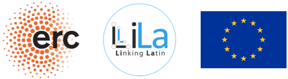

***

--<a href="2020">2020</a>--&nbsp;&nbsp;--<a href="2022">2022</a>--&nbsp;&nbsp;--<a href="2024">2024</a>--&nbsp;&nbsp;--<a href="2026">2026</a>--

***

# Workshop on Language Technologies for Historical and Ancient Languages

The ever increasing number of writings in historical and ancient languages available in digital form is leading to a growth of interest in the creation of tools for their automatic linguistic processing. However, these languages present a number of characteristics, which set them apart from modern languages, with a significant impact on language technologies. 

Typically, historical and ancient languages lack large linguistic resources, such as annotated corpora, and data can be sparse and very inconsistent; texts present considerable orthographic variation, they can be transmitted by different witnesses and in different critical editions, they can be incomplete and scattered across a wide temporal and geographical span. This makes the selection of representative texts, and thus the development of benchmarks, very hard. Moreover, texts in machine-readable format are often the result of manuscript digitization processes during which OCR systems can cause errors degrading the quality of the documents. Another peculiarity is that most of the texts written in historical and ancient languages are literary, philosophical or documentary, therefore of a very different genre from that on which LTs are usually trained, i.e. news. This is strictly connected to the fact that the final users of LTs for historical and ancient languages are mostly humanists, such as philologists, who expect a high accuracy of results that allows a precise analysis of linguistic data.

The workshop is also be the venue of EvaLatin, the first evaluation campaign totally devoted to the evaluation of NLP tools for Latin, and EvaHan, the first evaluation campaign dedicated to NLP tools for Ancient Chinese.

The first two editions of the workshop were organized in the context of the [*LiLa: Linking Latin*](https://lila-erc.eu/#page-top) ERC project, Grant Agreement No. 769994.

## References
- Bollmann, M., Dipper, S., Krasselt, J., & Petran, F. Manual and semi-automatic normalization of historical spelling-case studies from Early New High German. In KONVENS (pp. 342-350). 2012.
- Burns, Patrick J. “Building a Text Analysis Pipeline for Classical Languages.” In Berti, M. (Ed.) Digital Classical Philology. Ancient Greek and Latin in the Digital Revolution. Berlin, Boston: De Gruyter Saur. 2019.
- Dipper, Stefanie. "POS-Tagging of Historical Language Data: First Experiments." KONVENS. 2010.
- Eckhoff, H., Bech, K., Bouma, G., Eide, K., Haug, D., Haugen, O. E., & Jøhndal, M. The PROIEL treebank family: a standard for early attestations of Indo-European languages. Language Resources and Evaluation, 52.1 (2018), 29-65.
- Jenset, G. B., & McGillivray, B. Quantitative historical linguistics: A corpus framework. Oxford University Press (2017).
- Keersmaekers, A., and Van Hal, T. “Creating a large-scale diachronic corpus resource: Automated parsing in the Greek papyri (and beyond)”. In Natural Language Engineering, (2022): 1-30.
- Lee, John, and Mengqi Luo. "Inducing Word Clusters from Classical Chinese Poems." International Journal of Asian Language Processing 28.1 (2018): 13-30.
- Li, B., Yiguo Yuan, Jingya Lu, Minxuan Feng, Chao Xu, Weiguang Qu, Dongbo Wang. “The first international ancient Chinese word segmentation and POS tagging bakeoff: Overview of the EvaHan 2022 evaluation campaign.” In Proceedings of the Second Workshop on Language Technologies for Historical and Ancient Languages, 2022, pp. 135-140.
- McGillivray, Barbara, Marco Passarotti, and Paolo Ruffolo. "The Index Thomisticus Treebank Project: Annotation, Parsing and Valency Lexicon." TAL 50.2 (2009): 103-127.    
- Palladino, Chiara, Maryam Foradi, and Tariq Yousef. "Translation alignment for historical language learning: a case study." Digital Humanities Quarterly (2021): 15.3.
- Pettersson, Eva, and Joakim Nivre. "Improving verb phrase extraction from historical text by use of verb valency frames." Proceedings of the 20th Nordic Conference of Computational Linguistics (NODALIDA 2015). 2015.
- Piotrowski, Michael. "Natural language processing for historical texts." Synthesis lectures on human language technologies 5.2 (2012): 1-157.
- Sayoud, Halim, and Siham Ouamour. "Score Fusion Based Authorship Attribution of Ancient Arabic Texts." In The Thirtieth International Flairs Conference. 2017.
- Sommerschield, Thea. Yannis Assael, John Pavlopoulos, Vanessa Stefanak, Chris Dyer, John Bodel, Jonathan Prag, Ion Androutsopoulos, Nando de Freitas. “Machine Learning for Ancient Languages: A Survey.” In Computational Linguistics (2023): 1-44.
- Sprugnoli, Rachele, and Marco Passarotti. "Proceedings of LT4HALA 2020-1st Workshop on Language Technologies for Historical and Ancient Languages". European Language Resources Association (ELRA) , 2020.
- Sprugnoli, Rachele, and Marco Passarotti. "Proceedings of the Second Workshop on Language Technologies for Historical and Ancient Languages". European Language Resources Association (ELRA), 2022.

